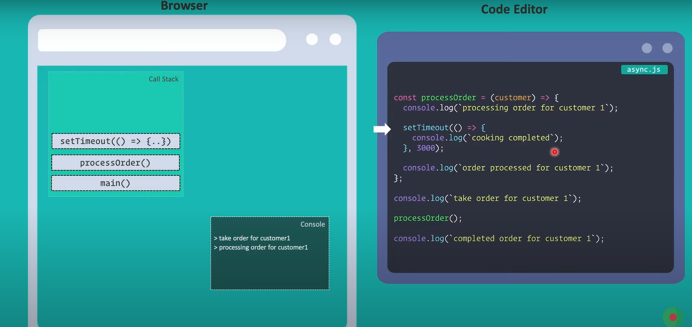
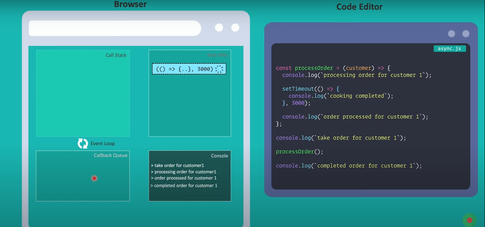

# Asynchronous Javascript
### How Javascript works in synchronous way in website

Browser এর v8 engine এ দুইটি পার্ট থাকে। একটি হলো heap অন্যটি call stuck. javascript মুলত এই call stuck এ কাজ করে। আমরা যখন কোড রান করি তখন শুরুতেই একটা main function call হয়। তার পর এক একটা function এর মধ্যে যায় এবং call stuck এ এক এক টা function জমা হতে থাকে। এই call stuck LIFO(Last in fast out) method use করে। এইভাবে javascript একটার পর একটা synchronous way te কোড রান করতে থাকে।
### How Javascript works in asynchronous way in website

কিন্তু javascript asynchronous way তে ও কোড রান করতে পারে। javascript যখন দেখতে পায় যে একটা asynchronous code run হচ্ছে তখন সে এই asynchronous code টাকে web api কে দিয়ে দেয় এবং পরের কোড গুলা run করে ফেলে। এই web api তে asynchronous code গুলা রান হওয়ার পর তা callback Queue এর মধ্যে চলে আসে তার পর event loop এর মধ্যে দিয়ে এই callback Queue র কোড গুলা FIFO(first in first out) method এ call stuck এ চলে আসে এবং যথারীতি রান হয়ে জায়।
